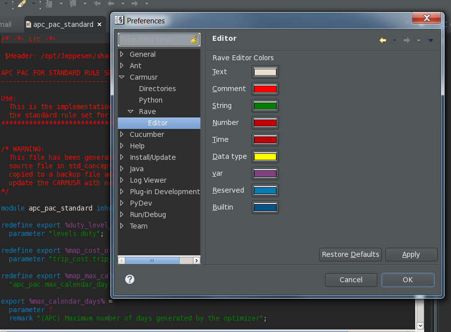

# Introduction

This is a small project that allows you to use a dark theme with the rave editor. 
To change the colors to something that you want you can find the settings under:

`Window > Preferences > Carmusr > Rave > Editor`

This simple project uses Apache Ant, therefore you will need `ant` and to edit a few properties in the `build.xml` file, for example:
* Path to your $CARMSYS 
* Path to your eclipse installation, which should be the one bundled within your $CARMSYS

**Note** In order for this work properly you need to have write privelages to the $CARMSYS, 
so what I recommend is setting this up first (for example copy the $CARMSYS to your local work directory).

## Build steps

* run ant task

`ant -f build.xml`

`ant install`

* Search and download a dark theme, I like this one:

https://raw.github.com/guari/eclipse-ui-theme/master/com.github.eclipseuitheme.themes.updatesite

* Start eclipse and install the dark theme

`Help > Install New Software...`

* Fixing fonts and colors for other editors

Some editors do not play well with dark themes (for example python). So to fix this you can install a preference file that will try
to resolve these gaps. This preference file is found in the **resource** folder of this project and is called **dws_darktheme_pref.epf**.

`File > Import... then select General > Preferences`

